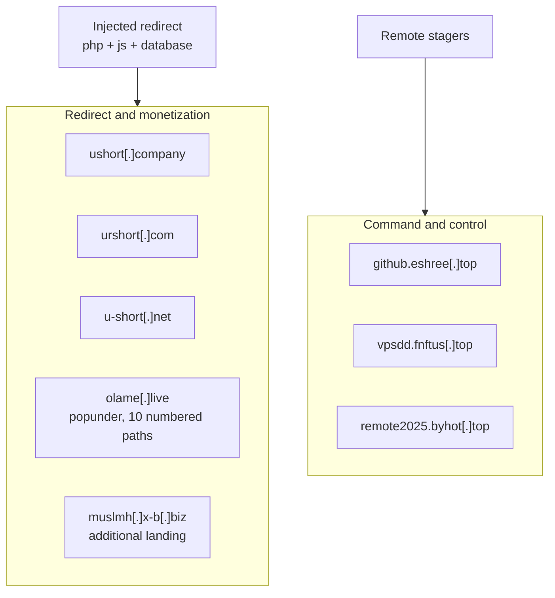
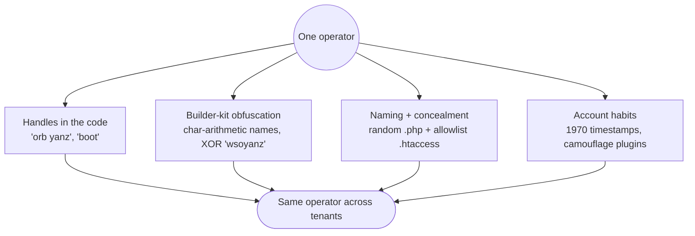

# Tracing the Operator

What can be said about who ran this, drawn only from the artifacts. Not a name, those are almost never recoverable from a web compromise, but a defensible picture of one operator, one toolkit, and a consistent set of infrastructure and habits. This piece is deliberate about the line between a real link and a coincidence.

*Attribution is a spectrum of confidence, not a verdict. Everything below is labelled by how strongly the evidence supports it. Attacker infrastructure is defanged; affected parties are anonymized.*

## The infrastructure, in two layers

The campaign ran two separate networks. One is what visitors were pushed to, the other is what the implants called home. Keeping them apart is what makes the map legible.

*Redirect infrastructure monetizes traffic; C2 infrastructure keeps control. Different hosts, different purpose.*

| Indicator | Defanged | Layer | Note |
|---|---|---|---|
| Shortener family | `ushort[.]company`, `urshort[.]com`, `u-short[.]net` | Redirect | Same operator rotating stem and TLD |
| Popunder | `olame[.]live` | Redirect | Ten numbered paths, mobile targeting |
| Additional landing | `muslmh[.]x-b[.]biz` | Redirect | Seen alongside the shorteners |
| Stager C2 | `github.eshree[.]top` | C2 | `eval(base64)` second stage, typosquats a trusted name |
| Loader C2 | `vpsdd.fnftus[.]top` | C2 | Parameterized payload delivery |
| Beacon | `remote2025.byhot[.]top` | C2 | URL-exfil check-in |

Two details in that table are themselves tradecraft. The `github.eshree[.]top` host **typosquats a trusted brand** in the leftmost label to survive a glance at the logs. And the shortener was not a single domain but a **family**: `ushort`, `urshort`, and the hyphenated `u-short`, rotated across TLDs so that blocking one string never stopped the redirect.

## A quiet tell: the shortener mirrored the victim's own paths

The injected links did not point at a bare shortener domain. They preserved the victim's own URL path and swapped only the host, so a page at `/<some-path>/` was rewritten to `https://urshort[.]com/<token>/<same-path>/`. The redirect kit walked the site's structure and reproduced it under the attacker domain.

That is a useful pivot. It means the redirect was generated with knowledge of the site map, consistent with the same server-side access that planted the shells, not a blind bulk find-and-replace of a single string.

## How the redirect paid

All of this access existed to make money, in the least glamorous way there is: reselling stolen traffic. The redirect chain is a monetization funnel.

- **Link shorteners** (`ushort`, `urshort`, `u-short`) pay the operator per redirect or per completed interstitial. Hijacked visitors are just inventory pushed through them.
- **The popunder** (`olame[.]live`) opens revenue-generating tabs, and its ten numbered paths and mobile targeting are built for the highest-yield, hardest-to-notice audience: phone users who bounce and blame the site.
- **Mirroring the victim's own paths** under the attacker domain preserved the appearance and any search-engine value of the original URL while swapping the destination, squeezing more from each stolen click.

None of this needs the victim to be a valuable target in its own right. The nonprofit was not chosen, its traffic was simply monetizable, which is why the same funnel appeared on every unrelated tenant on the host. Traffic hijacking is the quieter cousin of cryptojacking: no spike in CPU, no obvious damage, just a slow skim off every visitor until someone notices the redirect.

## Pivoting on the toolkit

Infrastructure can be rented, shared, or burned. The more durable link between victims is the toolkit itself, because its construction habits repeat.

*No single signal is proof. Together, across every tenant on the host, they cluster.*

- **Handles.** The shells carry author strings: `ORB YANZ BYPASS` in the WSO family, `WebShell by boot` in the file manager. These are the closest thing to a signature the operator left, though handles are copied and shared, so they cluster tools more than people.
- **Builder-kit fingerprint.** The [deobfuscation](./03-deobfuscation.html) showed the same construction choices reused: character-arithmetic function names, the XOR key `wsoyanz`, comment-noise splitting. These are habits of one kit, stronger than any hostname.
- **Concealment convention.** Every shell was a random lowercase filename paired with an allowlist `.htaccess` that denied all executables except that one file. The same shape appeared on unrelated tenants.
- **Account habits.** Rogue admins carried the impossible timestamp `1970-10-10 10:10:10`, and camouflage came as inactive copies of the `Protect Uploads` plugin. Both recurred.

## The observable timeline

Logs give a spine, with the caveat that the IPs in them may be attacker, defender, or noise.

| When | Event | Confidence |
|---|---|---|
| Mid-March | Redirect indicator already live in cron user-agents | High |
| Late March | Interactive shell used, direct POSTs to the shell path | High |
| March 29 | Server-side re-drop: rogue admins + camouflage plugins in one minute | High |
| April | Reinfection surfaced, redirect back via database and static `llms.txt` | High |
| July | Resurgence across sibling tenants on the same host | High |

Observed IPs included `129.0.226.200` (direct shell POST), `31.207.38.194` (rogue-admin session source, paired with a `Chrome/90` user agent), and `172.190.142.176` (scanning of shell paths). None can be tied to a person; they establish activity windows, not identity.

## What can and cannot be concluded

**Supported by the evidence (high confidence):**

- One operator, or one team sharing a toolkit, worked every affected tenant on the shared host.
- The operator had server-side write capability, evidenced by files, accounts, and sessions appearing together with no matching WordPress request.
- The monetization model was traffic hijacking through link shorteners and a mobile popunder.
- The persistence was designed to survive file-only cleanup, and did, three times.

**Not supported by the evidence (do not claim):**

- Any identity, nationality, or named group behind the infrastructure.
- Whether the C2 and redirect hosts are exclusive to this operator or shared services used by many.
- The current contents of the off-host C2 payloads, which the operator could change at any time.
- A precise initial-access exploit, which the retained logs do not pin down.

The honest summary is narrow and firm: this was one persistent operator working a shared host with a reusable, well-fingerprinted toolkit and a traffic-monetization goal. Everything beyond that, put a confidence label on it or leave it out.

Continue with the [indicators and YARA rules](./IOCs.html), the [deobfuscation walkthrough](./03-deobfuscation.html), or the [war story](./01-ir-war-story.html).
