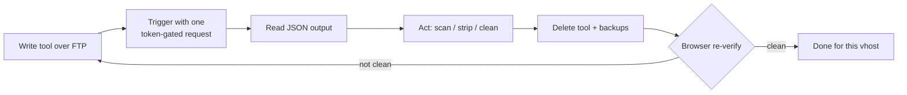

# Cleaning Without a Shell

The [war story](./01-ir-war-story.html) was cleaned with no SSH and no shell, over FTP, against a live site. That constraint shaped every tool. This is the reusable methodology: how to investigate and remediate a WordPress compromise when all you have is file access and the ability to drop a PHP file.

*The tools below are defender tools. They are token-gated, do one job, and are deleted after use. Excerpts are sanitized. Adapt them to your own engagement; do not leave any of them on a server.*

## The constraint drives the design

No shell means you cannot run commands on the host. But WordPress runs PHP, and FTP lets you write files. So the unit of work becomes a small, single-purpose PHP tool: upload it, trigger it with one HTTP request, read the output, and delete it. Everything is a variation on that loop.



*Every action is a throwaway tool. Nothing you drop is allowed to outlive the task.*

## Rule one: gate every tool with a token

The single biggest risk in this method is your own tooling. A cleanup script with file or database access is a backdoor if anyone else reaches it. So every tool refuses to run without a secret token, compared in constant time, and its filename carries a random suffix so it cannot be guessed:

```php
<?php
declare(strict_types=1);
const AUDIT_TOKEN = 'pick-a-long-random-value-per-run';

if (!isset($_GET['token']) || !hash_equals(AUDIT_TOKEN, (string) $_GET['token'])) {
    http_response_code(403);
    exit("forbidden\n");
}
header('Content-Type: application/json; charset=utf-8');
```

Use `hash_equals`, not `==`, so the check does not leak the token through timing. Give the file a random name like `audit-9f3a2c.php`. Delete it the moment you are done, and keep a local copy of what it reported.

## Finding what changed: an mtime cutover scan

The fastest way to find an implant is to ask what appeared after the compromise. A recursive scan that lists every executable-ish file newer than a cutover date turns thousands of files into a short list:

```php
$cutover = strtotime('2026-03-29 00:00:00');
$exts = ['php', 'phtml', 'phar', 'htaccess', 'user.ini'];

$it = new RecursiveIteratorIterator(
    new RecursiveDirectoryIterator(__DIR__, FilesystemIterator::SKIP_DOTS)
);
$hits = [];
foreach ($it as $f) {
    if (!$f->isFile()) continue;
    $ext = strtolower(pathinfo($f->getBasename(), PATHINFO_EXTENSION));
    if (!in_array($ext, $exts, true)) continue;
    if ($f->getMTime() < $cutover) continue;
    $hits[] = [
        'path'  => $f->getPathname(),
        'size'  => $f->getSize(),
        'mtime' => date('c', $f->getMTime()),
        'sha1'  => sha1_file($f->getPathname()),
    ];
}
echo json_encode(['count' => count($hits), 'items' => $hits], JSON_PRETTY_PRINT);
```

Sort the output by mtime and the fresh implants rise to the top. Record the hashes before you touch anything. Note that mtime can be forged, so treat it as a lead, not proof, and corroborate with content.

## Handling read-only JavaScript

The campaign set its injected `.js` files to mode `444`. A PHP process cannot overwrite a read-only file, so the naive strip fails silently. Over FTP you fix this directly: change the mode, then rewrite the file. In an FTP client this is `SITE CHMOD 644` followed by an upload; scripted, it is the same two steps:

```python
# minimal FTP strip: chmod the read-only .js back, then truncate at the marker
ftp.sendcmd('SITE CHMOD 644 ' + path)
data = fetch(path)
clean = data.split(INJECTION_MARKER)[0]     # keep everything before the injection
upload(path, clean)
```

This is the step a `curl`-only check never reveals, because the redirect lives in the JavaScript the browser runs, not in the HTML the fetch returns.

## Cleaning the database without breaking it

The database was the third home, and the two traps here are memory and false positives.

**Memory.** A single `UPDATE ... REPLACE` across `post_content` can load enormous rows and exhaust the PHP memory limit. The fix is to fetch the matching IDs first, then clean one row at a time:

```php
$ids = $db->query("SELECT ID FROM wp_posts WHERE post_content LIKE '%<marker>%'");
foreach ($ids as $id) {
    $row = $db->query("SELECT post_content FROM wp_posts WHERE ID = ?", [$id]);
    $clean = strip_injection($row['post_content']);   // targeted, not a blanket replace
    $db->query("UPDATE wp_posts SET post_content = ? WHERE ID = ?", [$clean, $id]);
}
```

**False positives.** Match the specific indicator, not a generic one. In this incident tens of thousands of contact-form spam rows contained the shortener string but were admin-only and never served to visitors. Cleaning them blindly would have destroyed legitimate data and inflated the real count. Scope the query to the specific marker, and exclude the tables you know are noise.

Do not forget the stores beyond posts: the `home` and `siteurl` options, the SEO plugin tables, and any static file the SEO plugin regenerates, such as `llms.txt`. Fixing the options alone leaves the static artifact to re-poison the site.

## Finish the way you started

The method ends where discipline matters most.

- **Verify in a browser, per vhost.** If the payload can hide in `.js` or the database, only a rendering engine reproduces it. `curl` is for speed, not for sign-off.
- **Match the family, not one literal.** The shorteners rotated stems and TLDs, so the hunt was a pattern, `ur?short` plus the hyphen form, not a single string.
- **Remove your own tools.** Every scanner, stripper, and cleaner you uploaded is now attack surface. Delete them and their JSON backups, and confirm they are gone.
- **Rotate and redeploy.** File cleanup does not undo stolen credentials or a server-side foothold. Rotate every credential class and redeploy code from a known-good source.

The [war story](./01-ir-war-story.html) is the narrative this served; the [reproduction lab](https://github.com/ZenithGenius/wordpress-webshell-campaign/tree/main/wp-persist-lab) lets you practice the read-only `.js` and database cleanup on a safe target.
