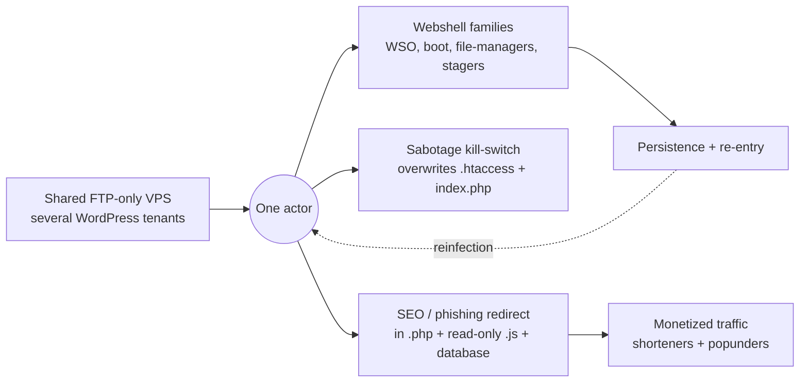

# WordPress Webshell Campaign

A persistent, reinfecting compromise across several WordPress sites sharing one FTP-only VPS. One threat actor, multiple webshell families, and a redirect payload that lived in three places at once. Cleaned blind over FTP, then cleaned again when it came back.

*A single nonprofit's site was the anchor of a wider campaign across tenants on the same host. All affected parties are anonymized; attacker indicators are published defanged for threat intelligence.*

## Read the series

This one incident is written up as three standalone pieces. Each answers a different question and does not repeat the others.

**1. [The war story: a compromise that would not die](./analysis/01-ir-war-story.md)** — *the defender's account.* How the payload hid in three places, why single-pass cleanup failed, the shell zoo, the sabotage kill-switch, and how it was all cleaned blind over FTP with no shell. **Available now.**

**2. The threat-actor campaign profile** — *the intel view.* Infrastructure map, shell-family fingerprints, rogue-admin tradecraft, MITRE ATT&CK, and victimology across the VPS. *Coming next.*

**3. The reproduction lab** — *hands-on.* Rebuild the compromise safely in an isolated Docker stack. *Coming after.*

## Indicators

[Indicators of compromise and YARA rules](./analysis/IOCs.md), defanged, for detection and threat intelligence.

---

*Investigated under authorization. The affected parties are anonymized throughout. Attacker indicators are published, defanged, for community threat intelligence.*
